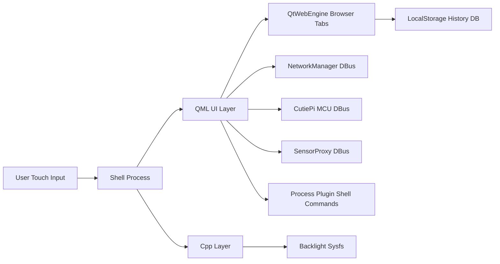
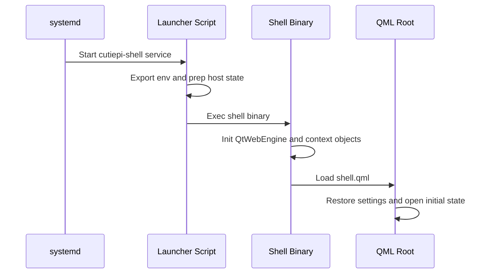

# Architecture

| Status | Date       | Project Version |
|--------|------------|-----------------|
| Draft  | 2026-05-25 | 0.0.1 |

This document describes the current architecture of the CutiePi shell codebase as implemented in this repository.

## 1. System Purpose

CutiePi shell is a tablet-style shell for Raspberry Pi OS, built with Qt/QML. It provides:

- A touch-first full-screen shell window
- A browser-centric tabbed experience with a side drawer
- Integrated app tabs (terminal, settings, factory mode)
- On-screen keyboard integration
- Wi-Fi scan/connect workflow
- Battery and charging status surfaced from MCU signals
- Orientation handling and lock screen/power-off flows

The implementation is split into:

- A main shell application (Qt Widgets + QML + QtWebEngine)
- A separate systray helper application
- A systemd unit and launcher script for runtime startup on target

## 2. High-Level Topology

## 3. Runtime Components

### 3.1 Main Shell Process

Primary binary entry is in source/app/main.cpp. Responsibilities:

- Initialize QtWebEngine and QApplication
- Configure runtime environment variables
- Expose C++ Backlight object to QML context
- Optionally attach adblock request interceptor and WebEngine profile
- Load the root QML from /opt/cutiepi-shell/shell.qml

Key architectural note:

- The launcher script exports QT_QPA_PLATFORM=eglfs, but main.cpp forces QT_QPA_PLATFORM=xcb at runtime. The process-level override means xcb wins for this binary.

### 3.2 QML Root UI

Root file is source/opt/cutiepi-shell/shell.qml. It acts as the shell orchestrator:

- ApplicationWindow plus state machine for modes:
  - normal
  - drawer
  - setting
  - popup
  - locked
  - switchoff
- Navigation bar, URL entry, tab management surface
- Slide-out settings sheet with volume/brightness/wifi list
- Lock screen and power-off UI overlays
- InputPanel integration for virtual keyboard and orientation-aware placement
- Notification and screenshot support

### 3.3 Tab and App Composition

Tab orchestration is implemented in source/opt/cutiepi-shell/tabControl.js:

- In-memory tab map keyed by generated page id
- Browser tabs created from WebView.qml
- App tabs created from:
  - Yat terminal screen
  - SettingView.qml
  - FactoryMode.qml
- URL normalization and search fallback to DuckDuckGo
- Local history persistence and query for URL suggestions

Supporting QML modules:

- WebView.qml: WebEngineView wrapper, popup/new-tab policy, custom media context menu
- SuggestionContainer.qml: URL history suggestion list UI
- SettingView.qml: system and appearance controls
- NetworkManager.qml: DBus wrapper and AP model for Wi-Fi
- PowerOffMenu.qml: slide-to-poweroff interaction
- TimeZoneDialog.qml and WallpaperDialog.qml: settings dialogs
- BlurPanel.qml: blurred overlay in settings sheet

### 3.4 Backlight Integration

Backlight integration is implemented in source/app/backlight.h and source/app/backlight.cpp:

- Discovers first backlight device under /sys/class/backlight
- Reads and writes brightness and max_brightness
- Controls bl_power (with inversion handling)
- Exposes methods/properties to QML

Permission model is assisted by source/app/backlight.rules, which adjusts group and write access for relevant sysfs nodes.

### 3.5 Systray Helper Process

A separate application in source/systray provides:

- Battery icon in system tray
- Screen lock toggle and power-off button reaction from MCU events
- Screen rotation command dispatch from accelerometer/gyroscope estimates

It uses:

- McuInfo plugin for serial input (/dev/ttyS0)
- Process plugin for invoking setBrightness, rotate-screen, and shutdown helper commands

## 4. External Interfaces

### 4.1 DBus Interfaces Used by Shell

Shell QML uses Nemo DBus plugin to access:

- io.cutiepi.service / io.cutiepi.interface (/mcu)
  - Event stream for battery, charge, and button events
- net.hadess.SensorProxy
  - AccelerometerOrientation property for orientation changes
- org.freedesktop.NetworkManager
  - Device discovery, AP scan/list, connection create/activate

### 4.2 System Commands Triggered from UI

Through the Process plugin, shell/settings actions invoke commands such as:

- rfkill block/unblock
- cpufreq-set governor changes
- amixer and pactl audio controls
- timedatectl timezone set
- sudo poweroff and reboot
- gsettings orientation-lock updates

This design gives broad control but tightly couples UI logic to host command availability and privilege configuration.

### 4.3 Web and Storage

- Browser engine: QtWebEngine
- Optional ad blocking: Brave ad-block library via QWebEngineUrlRequestInterceptor
- Local history database: QtQuick.LocalStorage (SQLite backend) with history and previous tables

## 5. Deployment and Startup

### 5.1 File System Layout

Installed runtime assets are expected under /opt/cutiepi-shell, including:

- shell.qml and companion QML files
- icon/media/font assets
- easylist.txt for adblock (optional but expected by interceptor)
- launcher script source/opt/cutiepi-shell/cutiepi-shell

### 5.2 Service Wiring

Systemd unit source/lib/systemd/system/cutiepi-shell.service:

- Runs as user pi
- ExecStart points to /opt/cutiepi-shell/cutiepi-shell
- Restart policy is always

Launcher script responsibilities:

- Exports runtime env vars (DBus session, Qt platform defaults)
- Ensures connman service is active
- Unblocks rfkill and sets CPU governor
- Starts shell binary

## 6. Control and Data Flows

### 6.1 Boot-to-Interactive Flow

### 6.2 Wi-Fi Connect Flow

1. Periodic timer requests scan via NetworkManager DBus.
2. AP list is rebuilt into QML ListModel.
3. User taps AP.
4. If secured AP:
	- Existing connection profile check is attempted first.
	- If absent, password dialog collects PSK and AddAndActivateConnection is called.
5. Connection state updates drive icon/status text.

### 6.3 Battery and Lock Flow

1. MCU event updates battery sample and charge state.
2. QML computes smoothed voltage and percentage bucket.
3. UI updates battery indicator and status text.
4. Button event toggles lock or enters switchoff mode.
5. Lock state drives brightness/visibility and CPU governor behavior.

## 7. State Management Model

State is distributed across layers:

- QML runtime properties for immediate UI behavior
- Qt.labs.settings for persisted user/system preferences
- LocalStorage tables for browser history
- In-memory tab registry in JavaScript
- External system state delegated to DBus services and OS commands

This is pragmatic and lightweight, but there is no central typed domain model or strict state transition validation beyond QML state logic.

## 8. Architectural Strengths

- Clear separation of shell UI and helper systray process
- Rich capability achieved with a compact QML-first implementation
- Good leverage of existing Linux services (NetworkManager, SensorProxy, DBus)
- Pluggable adblock capability at request interception layer
- Hardware backlight integration abstracted behind a QML-facing C++ object

## 9. Architectural Risks and Debt

1. Platform configuration ambiguity:
	- Launcher favors eglfs while binary forces xcb, creating deployment confusion.

2. Privilege and security surface:
	- UI-triggered sudo/system commands assume permissive host policy and can fail silently.

3. Tight environment coupling:
	- Hard-coded paths, user ids, and runtime locations reduce portability.

4. Error handling consistency:
	- Many DBus and command paths log errors but do not surface recoverable user feedback.

5. Concurrency and lifecycle concerns in adblock init:
	- Easylist parsing is spawned in a detached thread while request interception may start before parse completion.

6. Maintainability concerns:
	- shell.qml concentrates substantial behavior (UI, state machine, orchestration, command triggers).

## 10. Recommended Evolution Direction

1. Resolve graphics backend contract:
	- Decide single source of truth for platform plugin selection and document target profiles.

2. Extract orchestration services:
	- Move command and DBus orchestration out of root QML into testable C++/QML singleton services.

3. Harden privileged operations:
	- Introduce a bounded helper service API instead of direct command invocation from UI.

4. Improve observability:
	- Add structured runtime logs/metrics around DBus calls, command exits, startup, and crash loops.

5. Modularize shell.qml:
	- Break large root file into feature-scoped components and formalize state transitions.

6. Clarify process ownership:
	- Document and enforce how shell and systray are started together on target images.

## 11. Summary

The current architecture is a practical, QML-centric tablet shell with strong integration into Linux system services and hardware signals. It is feature-rich for its size and works through direct, low-ceremony integration patterns. The next architectural gains come from tightening runtime contracts (platform/privileges), decomposing orchestration logic, and improving resilience around external dependencies.
